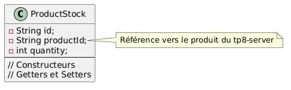
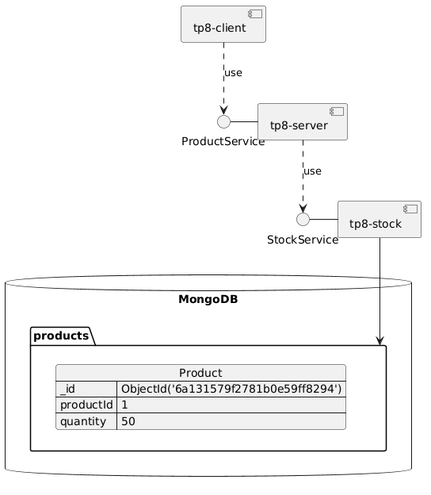
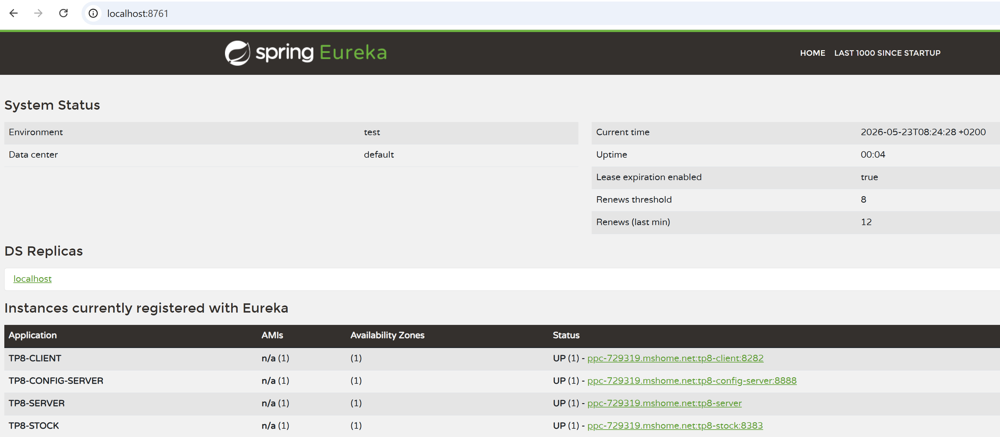
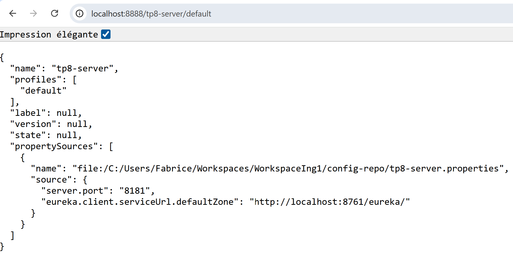
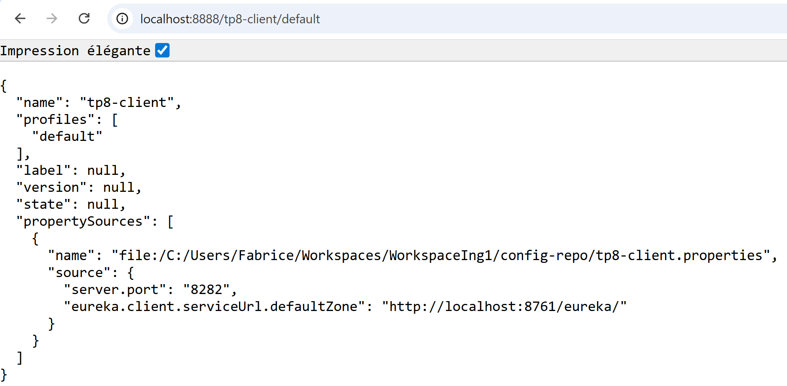
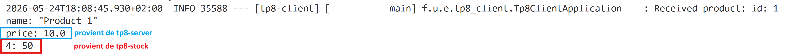
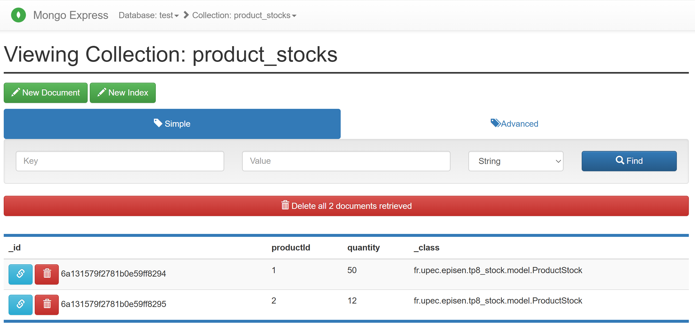

# Sujet 1: tp8 est une implémentation d'un projet à base de microservice avec grpc

## Besoin d'évolution

Dans les tp5 à tp7, il n'y a qu'un seul appel RPC entre le `tp7-client` et le `tp7-server`. Ce dernier retourne une valeur de produit coder en dur dans le code du service.

Il convient de mettre en place un nouveau microservice `tp8-stock` afin de disposer d'un système de persistance accessible propre à ce service. Dans cette configuration le client de ce nouveau service sera le projet `tp8-server`.

**Le scénario :** Quand le client demande un produit au `tp8-server`, ce dernier doit à son tour appeler `tp8-stock` (en gRPC) pour savoir si la quantité est disponible en magasin avant de répondre au `tp8-client`.

## Besoins logiciels

Il est nécessaire d'installer _MongoDB_ localement sur votre machine (ou d'utiliser un conteneur Docker, ou encore une instance gratuite MongoDB Atlas dans le cloud. L'application `tp8-stock` s'y connectera via son fichier de propriétés centralisé sur le _Config Server_.

## Démarche d'implémentation de tp8-stock: **durée 2h30**

- Étape 1 : Créer le fichier distant de configuration,
- Étape 2 : Initialiser le projet _Maven_ `tp8-stock`
- Étape 3 : Créer la couche d'accès aux données, avec une interface `StockRepository` pour accéder à la collections en lecture des `products`, un modèle de `ProductStock` représente la structure d'un document en base _MongoDB_,
- Étape 4 : Créer le service gRPC pour le stock nommé `StockServiceImpl` qui sera appelé depuis `tp8-server` dans la classe `ProductMicroService`. Ce service est une spécialisation d'une classe générée à partir d'un contract de codage `StockService`,

  

  

  @startuml
  class ProductStock {
      - String id;
      - String productId;
      - int quantity;
  ----
  // Constructeurs
  // Getters et Setters
  }

  note right of ProductStock::productId
  Référence vers le produit du tp8-server
  end note
  @enduml
  

- Étape 5 : Faire évoluer `tp8-server` afin qu'il puisse appeler `tp8-stock` depuis ses méthodes `getProduct` et `listProducts`. Il faudra pour cela utiliser le contrat de service défini dans le projet `tp8-stock`,
- Étape 6 : Faire évoluer `tp8-client` pour le lancement afin de tester ces 2 méthodes.

## Déroulement de la démo en cours: **durée 0h10**

Montrez l'indépendance des services :

1. Démarrez l'infrastructure (registry $\rightarrow$ config-server).
2. Démarrez les 3 microservices.
3. Faites un appel depuis le client : tout fonctionne.
4. Ouvrez un terminal, modifiez manuellement la quantité dans _MongoDB_.
5. Refaites l'appel depuis le client : la nouvelle quantité s'affiche instantanément sans avoir touché ni redémarré aucun code Java !

@startuml
interface "ProductService" as PS
interface "StockService" as SS

PS - [tp8-server]
SS - [tp8-stock]
[tp8-server] ..> SS : use
[tp8-client] ..> PS : use

database "MongoDB" {
  folder "products" {
    json Product {
       "_id": "ObjectId('6a131579f2781b0e59ff8294')",
       "productId": "1",
       "quantity": 50
    }
  }
}
[tp8-stock] --> [products]
@enduml

## Composants du tp8

Dans cette 4ème implémentation, 5 composants sont développés:
- `tp8-registry`: l'annuaire de service utilisant la librairie `Eureka`
- `tp8-config-server`: le serveur des configurations
- `tp8-stock`: le service de gestion des produits en base de données
- `tp8-server`: le fournisseur de service
- `tp8-client`: l'utilisateur de service

Les services ont en commun la connaissance de l'adresse de l'annuaire tp8-registry et peuvent le consulter. Cet annuaire dispose d'une interface Web à <http://localhost:8761>.

Chaque configuration est alors disponible via une interface Web:
- <http://localhost:8888/tp8-server/default>

- <http://localhost:8888/tp8-client/default>

- La console du `tp8-client` affiche au final

- La console Web de _MongoExpress_ affiche la collection initliser par `tp8-stock`

## Le livrable a fournir par mail à <fabrice.mourlin@u-pec.fr> via une url wetransfer

- Il se nomme `prenom_nom_num.zip`,  
où `prenom` est votre prénom, `nom` est votre nom et `num` est le numéro de sujet,
- Il contient les projets qui composent ce contrôle continu, ainsi qu'une exportation de la base de donnés MongoDB utilisée,
- Dans le cadre de cet épreuve, la base de données se nomme: `product_db`, le compte pour y accéder a pour login: `upec` et pour password `episen`,
- Un README.md qui contient l'ordre des commandes à effectuer pour faire les exécutions, ainsi que vos copies d'écran comme je l'ai fais dans cet énoncé.